# Arquitectura — Plataforma madre TRD Investment (borrador v1)

> Borrador para revisar juntos. Nace del análisis en `ANALISIS_TRD_INVESTMENT.md`.
> Decisión base (2026-08-21): **se EXTIENDE la app actual** (Next.js + Supabase + Vercel, un
> solo login) — NO es una app aparte. Última actualización: **2026-08-21**.

## Infraestructura y dominios (decisión 2026-08-21)
**Todo en una sola infraestructura**: un repo, **un proyecto de Vercel**, **un Supabase**. No se duplica nada;
un proyecto de Vercel sirve varios dominios. Constraint clave: las cookies de sesión son por dominio y **dos
subdominios `*.vercel.app` distintos NO comparten login** (vercel.app es public-suffix).
- **Elegido — Opción A (un dominio madre, ahora)**: la plataforma se identifica como **TRD Investment** (matriz);
  Leadtion pasa a ser **secciones por ruta** (`/cs`, `/afiliados`, `/membresias`) junto a `/trd`. **Un solo login.**
  El dominio pasa a ser el de la madre (ej. `trdinvestment.vercel.app`); el viejo `leadtionteam.vercel.app`
  **redirige** al nuevo (se configura en el panel de Vercel).
- **Futuro — Opción B** (cuando haya dominio propio comprado): `trdinvestment.com` + `leadtion.trdinvestment.com`
  con login compartido por el dominio raíz. Migración limpia desde A.
- **Pasos en Vercel (los hace el usuario)**: Project → Settings → Domains → agregar el dominio TRD y ponerlo como
  producción; dejar el dominio viejo como *redirect* al nuevo. Nada cambia en Supabase.
- **Lado código (lo hace Claude)**: identidad de plataforma = TRD Investment (metadata + hub `/modulos`); branding
  por ruta (Leadtion dentro de sus módulos, TRD dentro de `/trd`); redirect opcional por host en middleware.

## 0. Principios (no romper nunca)
1. **Una sola base de datos, el CLIENTE/ENTIDAD como nodo central.** Leadtion deja de ser una
   isla: pasa a ser una **rama** que la madre alimenta.
2. **Captura única + todo calculado.** Un dato se escribe una vez; el resto se deriva. Cero
   recaptura → cero descuadres.
3. **La madre es la FUENTE.** El cliente se crea arriba (cuadro de ingresos) y **baja en
   cascada** a Leadtion/Afiliados/CS. Nunca al revés.
4. **Doble moneda siempre** (USD principal + COP), con tasa por fecha.
5. **Motor de recordatorios único y transversal** (el dolor #1: que no se olvide cobrar).
6. **No perder ninguna conexión** → todo se piensa como "quién alimenta a quién".

---

## 1. Grafo de conexiones (quién alimenta a quién)

```mermaid
flowchart TD
    subgraph FUENTE["🟦 LA MADRE — punto de entrada"]
        CLI["CLIENTE / ENTIDAD<br/>(nodo central)"]
        FACT["Facturación mensual<br/>(líneas de servicio / MRR)"]
        EGR["Egresos del mes<br/>flag: ¿caja o mes?"]
        GF["Gastos fijos<br/>nómina + herramientas"]
        TRF["Transferencia LLC→Ebenezer<br/>(valor + tasa)"]
    end

    subgraph LEAD["🟩 RAMA LEADTION (ya construida)"]
        LMEM["Membresías / servicios"]
        LAFI["Afiliados"]
        LCS["Comisiones Customer Success"]
    end

    subgraph FIN["🟨 FINANZAS / TESORERÍA"]
        RESUMEN["Resumen del mes<br/>ingresos − gastos = utilidad<br/>− diezmo 10% = utilidad neta"]
        CAJALLC["Caja LLC (USD)"]
        CAJACOL["Caja Col — Ebenezer (COP)"]
        REG["REG — pago a colaboradores<br/>ICA + renta + girar"]
        CRED["Crédito Bancolombia<br/>(amortización)"]
    end

    subgraph SERV["🟪 SERVICIOS RECURRENTES"]
        CLOUD["Cloud TRD<br/>hosting/dominio (anual)"]
        MANT["Mantenimiento web<br/>WordPress (trimestral)"]
    end

    REM["🔔 MOTOR DE RECORDATORIOS<br/>(transversal)"]
    CFG["⚙️ Config: tasa FX · UVT · tarifas ICA CIIU · % reparto · GHL · % nómina"]

    CLI -->|plan agencia c/ Leadtion| LMEM
    CLI -->|servicio Leadtion suelto| LMEM
    CLI -->|vino por referido| LAFI
    CLI -->|¿entra a CS?| LCS
    CLI --> FACT
    CLI --> CLOUD
    CLI --> MANT

    FACT --> RESUMEN
    LMEM --> RESUMEN
    CLOUD --> RESUMEN
    MANT --> RESUMEN
    EGR -->|sale del mes| RESUMEN
    EGR -->|sale de caja| CAJALLC
    GF --> RESUMEN
    GF --> REG
    REG --> CAJACOL
    RESUMEN --> CAJALLC
    TRF -->|salida USD| CAJALLC
    TRF -->|entrada COP| CAJACOL
    CRED --> EGR

    CLOUD --> REM
    MANT --> REM
    FACT -->|contrato 4 meses| REM
    REG --> REM
    CRED --> REM

    CFG -.-> FACT
    CFG -.-> REG
    CFG -.-> CAJACOL
    CFG -.-> RESUMEN
```

---

## 2. Modelo de datos (entidades y relaciones)

Nodo central en **negrita**; entre paréntesis, si ya existe en Leadtion o es nuevo.

### Núcleo
- **`entidad_marca`** (nuevo): TRD Investment LLC, TRD Agency, Leadtion, Ebenezer M&M SAS. Sirve
  para atribuir ingresos/egresos/nómina a una marca/entidad.
- **`cliente`** (EXISTE `clientes` en Leadtion → se EXTIENDE): nodo central. Campos madre a sumar:
  `entidad_factura` (LLC / COL-Ebenezer), `tipo` (estándar / agencia / servicio — ya existe),
  `origen_afiliado` (fk afiliado, si vino referido), `fecha_registro`, `estado`, `moneda_pactada`.
  Deriva flags: `incluye_leadtion`, `entra_cs`.

### Ingresos
- **`servicio_contratado`** (nuevo, generaliza): línea de lo que un cliente tiene contratado.
  Tipos: plan marketing agencia, social media advance, eventos, grabación, hosting, dominio,
  mantenimiento web, + los de Leadtion (membresía/AI/reactivación/level up). Cada uno: precio,
  moneda, recurrencia (mensual/cuatrimestral/anual/trimestral/puntual), fecha inicio/fin.
- **`factura_mensual`** (nuevo; parte se deriva de Leadtion `pagos_mensuales`): por cliente/mes.
  Estado semáforo (pagado/facturado/programado/anulado/por facturar), medio (Stripe/Zelle/
  Bancolombia), comisión pasarela, neto. Clientes COL: COP → IVA 19% → neto USD a la tasa.

### Egresos / gastos
- **`egreso`** (nuevo): entidad_marca, concepto (libre), fecha, USD, COP, **`afecta_utilidad`
  (sí=gasto del mes / no=sale de caja)**. ← la regla clave del cuadro 2026.
- **`gasto_fijo`** (nuevo): nómina + herramientas/suscripciones. Campos: entidad_marca,
  recurrencia, **% reparto** (arriendo/luz/internet), amortización (hosting anual), a qué
  cálculo entra.
- **`colaborador`** (EXISTE en CS → se EXTIENDE): + `actividad_ciiu`, datos para retención.
- **`pago_colaborador` (REG)** (nuevo): mes, cuenta de cobro, aporte salud/pensión, **ReteICA**,
  **ReteRenta**, valor a girar, costo transferencia (asume Ebenezer), checklist 4 estados
  (correo enviado · drive · registro app · pagado). Fórmulas ya confirmadas en el análisis.

### Tesorería
- **`caja_llc`** / **`caja_col`** (nuevo): saldos y movimientos por mes.
- **`transferencia`** (nuevo): LLC→Ebenezer, valor USD, tasa, COP resultante, fecha.
- **`credito`** (nuevo): Bancolombia (saldo, cuota, interés, capital) → genera egreso mensual.

### Transversal
- **`recordatorio`** (nuevo): tipo (renovación hosting/dominio, ciclo mantenimiento, fin de
  contrato, cobro mensual, pago nómina, cuota crédito…), fk (cliente/colaborador/servicio),
  fecha_vencimiento, estado (pendiente/hecho/dado de baja).
- **`config`** (EXISTE `config_negocio` → se EXTIENDE): tasa FX diaria, UVT por año, tabla
  tarifas ICA por CIIU, % reparto, GHL $497, % nómina por marca (Daniel 30% Leadtion, etc.).
- **`afiliado` / `clientes_afiliados`** (EXISTEN en Leadtion): se reutilizan.

---

## 3. Reglas de derivación al CREAR un cliente en la madre
Al guardar "Melia Residence" el sistema pregunta/deriva y sincroniza solo (una sola transacción):
1. **¿Entidad de factura?** LLC (USD) o Colombia-Ebenezer (COP+IVA).
2. **¿Tipo?** estándar / agencia / servicio.
   - **agencia con Leadtion incluido** → crea el cliente en Leadtion con plan agencia (licencia
     incluida, tal cual hoy) + contrato cuatrimestral → recordatorios de cobro mensual y fin de contrato.
   - **servicio Leadtion suelto** (AI/Reactivación/Level Up/membresía) → registra el servicio en
     Leadtion (usa la lógica ya existente: `crearMembresia` / `registrarServicio`).
3. **¿Vino por afiliado?** ¿quién? → registra en Afiliados (agencia/partner) — como ya funciona.
4. **¿Entra a Customer Success?** → marca `entra_cs` (hoy CS comisiona por fecha a todo el equipo).
5. Se crean las **líneas de `servicio_contratado`** y las **facturas** del mes según recurrencia.
> Regla ya confirmada en el análisis: agregar/registrar servicios **no altera** comisiones ya
> pagadas de CS/afiliados. Se respeta.

---

## 4. Flujos de dinero (resúmenes que se calculan solos)
- **Resumen del mes** = Σ ingresos (facturación + Leadtion + Cloud + mantenimiento) − Σ gastos
  (fijos + nómina + egresos "del mes" + comisiones) → **utilidad** → − diezmo 10% → **utilidad neta**.
- **Caja LLC** = arrastre mensual: saldo previo + ingresos − egresos "de caja" − transferencia a
  Ebenezer. Muestra **caja disponible** (hoy no sana → objetivo sanearla).
- **Caja Col (Ebenezer)** = entrada de la transferencia LLC + ingresos clientes COL − nómina −
  donaciones − costos transferencia − internet/proveedor. Debe **cuadrar con el banco real**.
- **REG** = por colaborador: cuenta de cobro − ICA − renta = girar (fórmulas confirmadas).

---

## 5. Orden de construcción sugerido (de menor riesgo/mayor valor → a lo más delicado)
1. **Capa de config + doble moneda** (tasa FX, UVT, tarifas ICA CIIU, % nómina/reparto). Base de todo.
2. **Módulo REG (retenciones + pago a colaboradores)** — ya 100% definido, aislado, alto valor,
   no toca Leadtion. Buen primer entregable "que se ve funcionando".
3. **Egresos con flag + Gastos fijos/nómina + Resumen del mes** (utilidad/diezmo).
4. **Caja LLC + Caja Col + Transferencias** (tesorería) + **Crédito Bancolombia**.
5. **Motor de recordatorios** (transversal) — enchufa a contratos, Cloud, mantenimiento, nómina, crédito.
6. **Cloud TRD + Mantenimiento web** (renovaciones recurrentes).
7. **Creación de cliente en cascada** (madre → Leadtion/Afiliados/CS) — lo más delicado; se hace al
   final, cuando el resto esté sólido, para no arriesgar lo que ya funciona en Leadtion.
8. **Facturación mensual completa** (semáforo de estados, medios, pasarela, COL con IVA).

---

## 6. Preguntas abiertas para cerrar antes de construir
- Depuración exacta de renta por persona (aportes salud/pensión) — confirmar caso a caso.
- Fórmula/lookup exacto de ReteICA (ya reversada, falta ver la celda) — pendiente menor.
- ¿Los recordatorios avisan **dentro de la app** solamente, o también por **correo/WhatsApp**?
- ¿Cada marca (TRD Agency / Leadtion / Ebenezer) necesita su propio P&L, o basta el consolidado + filtro?
